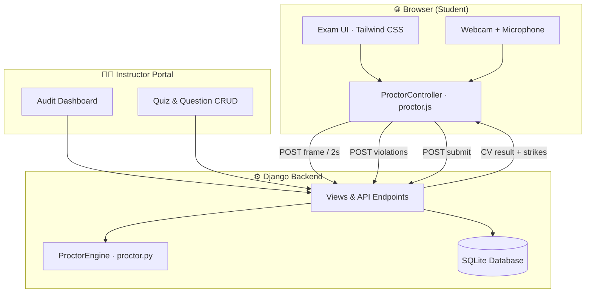

<p align="center">
  
</p>

<h1 align="center">Brainiac Proctored Smart Assessment Portal</h1>

<p align="center">
  <strong>A full-stack, AI-assisted online examination platform with real-time proctoring, integrity scoring, and instructor audit tools.</strong>
</p>

<p align="center">
  <a href="https://github.com/brainiacweb-tech/Brainiac-Proctored-Smart-Assessment-Portal-"></a>
  <a href="https://www.djangoproject.com/"></a>
  <a href="https://opencv.org/"></a>
  <a href="https://tailwindcss.com/"></a>
  <a href="LICENSE"></a>
</p>

<p align="center">
  <a href="#-features">Features</a> •
  <a href="#-architecture">Architecture</a> •
  <a href="#-quick-start">Quick Start</a> •
  <a href="#-demo-accounts">Demo Accounts</a> •
  <a href="#-proctoring-engine">Proctoring</a> •
  <a href="#-api-reference">API</a> •
  <a href="#-credits">Credits</a>
</p>

---

## 📖 Overview

**Brainiac Proctored Smart Assessment Portal** is a production-ready web application designed for institutions and training programs that need secure, monitored online assessments. It combines a polished student experience with powerful instructor tooling — including live webcam proctoring, computer-vision violation detection, audio noise monitoring, multi-display detection, and a comprehensive audit dashboard with snapshot evidence.

Built with **Django 4.2** on the backend and modern **HTML5 / ES6 / Tailwind CSS** on the frontend, the platform supports role-based access for **Students** and **Instructors**, timed quizzes with multiple-choice and short-answer questions, and automatic integrity scoring with disqualification policies.

> 🎯 **Use cases:** University exams, certification tests, corporate training assessments, coding bootcamp evaluations, and any scenario requiring supervised remote testing.

---

## ✨ Features

### 👨‍🎓 Student Experience

| Feature | Description |
|---------|-------------|
| 📝 **Quiz Dashboard** | Browse available exams with themed cards, time limits, and question counts |
| 🎥 **Pre-Exam Checklist** | Webcam preview, microphone check, single-display verification, and full-screen launch |
| ⏱️ **Timed Exams** | Live countdown timer with auto-submit when time expires |
| 📊 **Live Proctor Feed** | Real-time webcam view with face, audio, and display status indicators |
| ⚠️ **Violation Alerts** | Modal warnings with strike count and integrity score updates |
| 📋 **Results Review** | Post-exam score, integrity percentage, and answer breakdown |

### 👨‍🏫 Instructor Experience

| Feature | Description |
|---------|-------------|
| ➕ **Quiz Management** | Create, edit, and delete quizzes with custom time limits and warning thresholds |
| ❓ **Question Builder** | Add multiple-choice (A–D) and short-answer questions with ordering |
| 🔍 **Audit Dashboard** | Review all student attempts with violation logs and snapshot thumbnails |
| 📈 **Performance Metrics** | View scores, integrity scores, warning counts, and attempt status |
| 👥 **Role-Based Access** | Separate dashboards for instructors and students |

### 🛡️ Proctoring & Integrity

| Detection Type | Method | Trigger |
|----------------|--------|---------|
| 👤 **No Face** | OpenCV Haar Cascade CV | Face absent from webcam frame |
| 👥 **Multiple Faces** | OpenCV Haar Cascade CV | More than one face in frame |
| 🔄 **Head Turned** | Geometric orientation check | Face center outside safe zone |
| 🔊 **Excessive Noise** | Web Audio API (`AnalyserNode`) | Sustained loud ambient audio |
| 🖥️ **Multiple Displays** | Window Management API + heuristics | HDMI / extended / dual-monitor setup |
| 📑 **Tab Switch** | Page Visibility API | Browser tab hidden during exam |
| 🪟 **Window Blur** | `window.blur` event | Exam window loses focus |

**Integrity scoring:** `max(0, 100 − violations × 15)`  
**Auto-disqualification:** Triggered when warning count exceeds the quiz's configured maximum (default: 3).

All violations are **debounced** (consecutive detections required) and subject to a **15-second cooldown** per violation type to reduce false positives.

---

## 🏗 Architecture



### Data Model

```
User (STUDENT | INSTRUCTOR)
 └── Quiz
      ├── Question (MC | Short Answer)
      └── QuizAttempt
           ├── Answer
           └── ViolationLog (with snapshot + details)
```

---

## 🛠 Tech Stack

| Layer | Technology |
|-------|------------|
| **Backend** | Python 3 · Django 4.2 · SQLite |
| **Computer Vision** | OpenCV (Haar Cascades) · NumPy · Pillow |
| **Frontend** | HTML5 · ES6 JavaScript · Tailwind CSS |
| **Icons** | Lucide Icons |
| **Auth** | Django session-based authentication with custom `User` model |
| **Proctoring Sync** | RESTful JSON API · HTTP POST every ~2 seconds |

---

## 🚀 Quick Start

### Prerequisites

- **Python 3.10+** (3.11 or 3.12 recommended)
- **pip** and **venv**
- A modern browser with **camera and microphone** support (Chrome or Edge recommended for display detection)

### Installation

```bash
# 1. Clone the repository
git clone https://github.com/brainiacweb-tech/Brainiac-Proctored-Smart-Assessment-Portal-.git
cd Brainiac-Proctored-Smart-Assessment-Portal-

# 2. Create and activate a virtual environment
python -m venv venv

# Windows
venv\Scripts\activate

# macOS / Linux
source venv/bin/activate

# 3. Install dependencies
pip install -r requirements.txt

# 4. Apply database migrations
python manage.py migrate

# 5. Seed demo data (accounts + 5 quizzes × 25 questions)
python manage.py seed_demo

# 6. Start the development server
python manage.py runserver
```

Open **http://127.0.0.1:8000/** in your browser.

---

## 🔑 Demo Accounts

| Role | Username | Password | Access |
|------|----------|----------|--------|
| 👨‍🏫 **Instructor** | `instructor` | `instructor123` | Quiz CRUD, audit dashboard, all student data |
| 👨‍🎓 **Student** | `student` | `student123` | Take proctored exams, view own results |

---

## 📚 Demo Quizzes

The `seed_demo` command creates **five full quizzes**, each with **25 questions**:

| # | Quiz Title | Focus Area |
|---|------------|------------|
| 1 | Introduction to Python | Variables, functions, OOP, exceptions |
| 2 | Mobile App Development | Platforms, UI patterns, lifecycle, APIs |
| 3 | Networking and Security | Protocols, encryption, firewalls, cybersecurity |
| 4 | Database Management | SQL, normalization, relational design |
| 5 | Company Law | Corporate governance, legal structures, regulations |

Each quiz is configured with a **50-minute** time limit and **3 maximum warnings**.

---

## 🎓 User Workflows

### Student — Taking a Proctored Exam

1. **Log in** with student credentials
2. Select a quiz and click **Start Exam**
3. Complete the **pre-exam checklist** (camera, mic, single display)
4. Enter **full-screen mode** and begin the timed exam
5. Answer questions while the proctor monitors in the sidebar
6. **Submit** manually or wait for auto-submit when time runs out
7. Review **score**, **integrity score**, and **violation log**

### Instructor — Managing Assessments

1. **Log in** with instructor credentials
2. Create quizzes and add questions from the instructor dashboard
3. Monitor student activity via the **Audit Dashboard**
4. Review violation snapshots, timestamps, and detailed evidence
5. Drill into individual attempts for full answer and violation breakdowns

---

## 🔬 Proctoring Engine

### Frontend (`static/js/proctor.js`)

The `ProctorController` class orchestrates all client-side monitoring:

- Captures webcam frames every **2 seconds** and sends them to the server for CV analysis
- Monitors microphone levels via the **Web Audio API** with adaptive baseline calibration
- Detects extended displays using **`window.screen.isExtended`**, **`getScreenDetails()`**, and window-position heuristics
- Listens for tab visibility changes and window focus loss
- Applies debouncing and per-type cooldowns before logging strikes

### Backend (`assessments/proctor.py`)

The `ProctorEngine` processes incoming JPEG frames:

- Decodes base64 snapshots into OpenCV matrices
- Runs **Haar Cascade** frontal-face detection
- Validates single-face presence and head orientation within a central safe zone
- Returns annotated preview frames with bounding boxes
- Maps CV flags to violation event types when strikes are confirmed

### Violation Types

| Code | Label |
|------|-------|
| `NO_FACE` | No Face Detected |
| `MULTIPLE_FACES` | Multiple Faces Detected |
| `HEAD_TURNED` | Head Turned Away |
| `NOISE_DETECTED` | Excessive Noise Detected |
| `MULTIPLE_DISPLAY` | Multiple Displays Detected |
| `TAB_SWITCH` | Tab Switch / Window Blur |
| `WINDOW_BLUR` | Window Focus Lost |

---

## ⚙️ Configuration

Proctoring behavior is controlled in `config/settings.py`:

```python
# Frame capture & face detection
PROCTOR_FRAME_INTERVAL_MS = 2000      # Milliseconds between CV frame uploads
PROCTOR_FACE_DEBOUNCE_CHECKS = 2      # Consecutive bad frames before a strike

# Integrity scoring
PROCTOR_INTEGRITY_PENALTY = 15        # Points deducted per violation

# Audio / noise monitoring
PROCTOR_NOISE_THRESHOLD = 0.38        # Normalized loudness threshold (0–1)
PROCTOR_NOISE_DEBOUNCE_CHECKS = 3     # Consecutive loud samples before strike
PROCTOR_NOISE_SAMPLE_MS = 500         # Audio sampling interval

# Display monitoring
PROCTOR_DISPLAY_CHECK_MS = 3000       # Display check interval
PROCTOR_DISPLAY_DEBOUNCE_CHECKS = 2   # Consecutive detections before strike

# General
PROCTOR_VIOLATION_COOLDOWN_MS = 15000 # Minimum gap between same-type violations
```

> ⚠️ **Production checklist:** Change `SECRET_KEY`, set `DEBUG = False`, configure `ALLOWED_HOSTS`, and use PostgreSQL or MySQL instead of SQLite.

---

## 📡 API Reference

All API endpoints require an authenticated session and CSRF token.

| Method | Endpoint | Description |
|--------|----------|-------------|
| `POST` | `/assessments/api/attempt/<id>/analyze/` | Send camera frame for CV analysis |
| `POST` | `/assessments/api/attempt/<id>/violation/` | Log a frontend-detected violation |
| `POST` | `/assessments/api/attempt/<id>/submit/` | Submit quiz answers and finalize attempt |
| `GET`  | `/assessments/api/attempt/<id>/status/` | Poll current attempt status |

### Analyze Frame — Request

```json
{
  "frame": "data:image/jpeg;base64,...",
  "confirm_strike": false
}
```

### Analyze Frame — Response

```json
{
  "status": "OK",
  "face_count": 1,
  "processed_frame": "<base64>",
  "strike_logged": false,
  "warning_count": 0,
  "integrity_score": 100
}
```

### Log Violation — Request

```json
{
  "event_type": "NOISE_DETECTED",
  "snapshot": "<base64>",
  "duration_ms": 0,
  "details": "Excessive background noise detected (level 42%)"
}
```

---

## 📁 Project Structure

```
Brainiac-Proctored-Smart-Assessment-Portal-/
├── accounts/                          # Authentication & custom User model
│   ├── models.py                      # User (STUDENT / INSTRUCTOR roles)
│   ├── views.py                       # Login, register, logout
│   └── forms.py                       # Registration forms
├── assessments/
│   ├── models.py                      # Quiz, Question, QuizAttempt, ViolationLog
│   ├── views.py                       # Dashboards, quiz flow, REST API
│   ├── proctor.py                     # OpenCV computer-vision engine
│   ├── cascades/                      # Bundled Haar cascade classifiers
│   ├── templatetags/quiz_extras.py    # Quiz themes & Lucide icon tag
│   └── management/commands/
│       ├── seed_demo.py               # Demo data seeder
│       └── quiz_question_banks.py     # Question bank definitions
├── config/
│   ├── settings.py                    # Django & proctoring configuration
│   └── urls.py                        # Root URL routing
├── static/
│   ├── css/app.css                    # Design system & component styles
│   ├── js/proctor.js                  # Frontend proctoring controller
│   ├── js/password-toggle.js          # Auth password visibility toggle
│   └── images/                        # Brand logos & favicon
├── templates/
│   ├── base.html                      # Layout, navbar, footer
│   ├── accounts/                      # Login & register pages
│   └── assessments/                   # Dashboards, exam flow, audit views
├── requirements.txt
├── manage.py
└── README.md
```

---

## 🌐 Browser Compatibility

| Feature | Chrome | Edge | Firefox | Safari |
|---------|--------|------|---------|--------|
| Webcam / Microphone | ✅ | ✅ | ✅ | ✅ |
| Face detection (server-side) | ✅ | ✅ | ✅ | ✅ |
| Tab / focus detection | ✅ | ✅ | ✅ | ⚠️ Limited |
| Multi-display (`getScreenDetails`) | ✅ | ✅ | ❌ | ❌ |
| Full-screen mode | ✅ | ✅ | ✅ | ✅ |

> 💡 For the most reliable multi-display detection, use **Google Chrome** or **Microsoft Edge**.

---

## 🤝 Contributing

Contributions are welcome! To get started:

1. **Fork** the repository
2. Create a feature branch: `git checkout -b feature/your-feature-name`
3. Commit your changes: `git commit -m "Add your feature description"`
4. Push to the branch: `git push origin feature/your-feature-name`
5. Open a **Pull Request**

Please ensure code follows existing conventions and that migrations are included for model changes.

---

## 📄 License

This project is licensed under the **MIT License** — see the [LICENSE](LICENSE) file for details.

---

## 👤 Credits

<p align="center">
  <strong>Developed by Francis Kusi</strong><br>
  <a href="https://github.com/brainiacweb-tech">brainiacweb-tech</a>
</p>

<p align="center">
  <sub>Built with Django · OpenCV · Tailwind CSS · Lucide Icons</sub>
</p>

---

<p align="center">
  ⭐ If this project helped you, consider giving it a star on GitHub!
</p>
